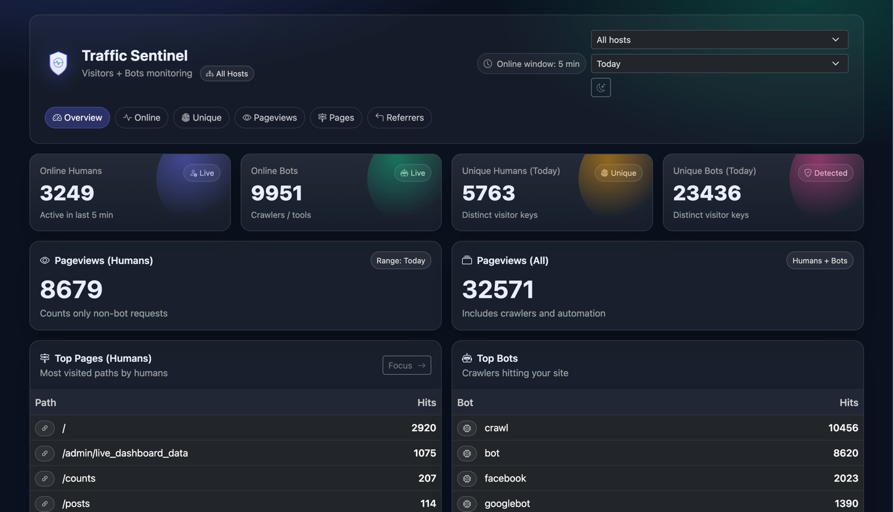

<p align="center">
  
</p>
<p align="center">
  <a href="https://packagist.org/packages/kianisanaullah/laravel-traffic-sentinel">
    
  </a>
  <a href="https://packagist.org/packages/kianisanaullah/laravel-traffic-sentinel">
    
  </a>
  
  
</p>

<h1 align="center">Traffic Sentinel</h1>

<p align="center">
🚦 <b>Self-hosted Laravel traffic analytics</b> for <b>humans vs bots</b>, online users, pageviews, referrers, and crawler detection —
<b>no Google Analytics, no cookies, no third-party tracking</b>.
</p>

## 🤔 Why Traffic Sentinel?

Most Laravel apps either:

- rely on **Google Analytics** (privacy issues, blocked by ad-blockers), or
- use **heavy analytics tools** that are hard to self-host.

**Traffic Sentinel is different:**

- ✅ 100% self-hosted (your DB, your rules)
- 🔐 Privacy-first (hashed IPs, optional raw IP, no cookies by default)
- 🤖 Built to separate **real humans vs crawlers**
- ⚡ Lightweight — no JS frameworks, no trackers, no beacons
- 🧩 Designed for **developers**, not marketers

If you want *operational visibility* instead of marketing analytics, Traffic Sentinel fits perfectly.

---

## 🆚 How it compares

| Feature          | Traffic Sentinel | Google Analytics | Laravel Telescope |
|------------------|------------------|------------------|-------------------|
| Self-hosted      | ✅ Yes            | ❌ No             | ✅ Yes             |
| Privacy-friendly | ✅ Yes            | ❌ No             | ✅ Yes             |
| Bot detection    | ✅ Built-in       | ⚠️ Limited       | ❌ No              |
| Online users     | ✅ Yes            | ❌ No             | ❌ No              |
| Pageviews        | ✅ Yes            | ✅ Yes            | ❌ No              |
| Production-safe  | ✅ Yes            | ✅ Yes            | ❌ No              |
| External scripts | ❌ None           | ✅ Required       | ❌ None            |

Traffic Sentinel focuses on **traffic intelligence**, not debugging or marketing.

## ✨ Features

- 🔐 Privacy-first analytics (hashed IPs, optional raw IP, no cookies by default)
- ✅ Human vs Bot detection (UA keywords + heuristics)
- 👀 Online users (last N minutes)
- 📊 Pageviews (humans / all)
- 🔎 Top pages, bots & referrers
- 🚫 Exclude internal paths, hosts, IPs & UAs
- 🧠 Runtime IP → Country / ASN lookup (no external APIs)
- 🧹 Prune old data (`traffic:prune`)
- 🖥️ Modern dashboard (Bootstrap 5)
- ⚡ No JS framework dependency
- 🌍 Optional runtime IP lookup (Country + Flag + ASN) using offline datasets
- ⬇️ One-command dataset installer (`traffic-sentinel:ipdata:install`)
- 🧩 Click any IP in the dashboard to open a modern IP details modal (optional)

### 🔐 IP Privacy Modes (Important)

Traffic Sentinel can store IPs in multiple ways:

- **Hashed IP** (`ip.store = hashed`) → privacy-friendly, recommended
- **Full IP** (`ip.store = full`) → store readable IP in `traffic_sessions.ip`
- **Raw IP (optional)** (`privacy.store_raw_ip = true`) → stores the real client IP in `traffic_sessions.ip_raw`

> Tip: Many apps keep `ip.store = hashed` but still want runtime geolocation. We support runtime lookup without storing
location in DB. 

> Traffic Sentinel never sends IPs to external services — all lookups are local.

---

## 📦 Installation

```bash
composer require kianisanaullah/laravel-traffic-sentinel
```

## Publish config & migrations:

php artisan vendor:publish --tag=traffic-sentinel-config
php artisan vendor:publish --tag=traffic-sentinel-migrations
php artisan migrate

## 🧩 Middleware

Option A — Auto register (recommended for most apps)

In config/traffic-sentinel.php:

```bash
'middleware' => [
'auto_register' => true,
],
```

Option B — Manually register

Add to your web middleware group:

```bash
\Kianisanaullah\TrafficSentinel\Http\Middleware\TrackTraffic::class,
```

## 📊 Dashboard

/admin/traffic-sentinel

## 🖼️ Dashboard Preview

> Clean, readable, production-ready dashboard.



## 🔐 Protect Dashboard

Protect it in config:
'dashboard' => [
'middleware' => ['web', 'auth'],
],

## 🚫 Excluding URLs

```bash
'exclude' => [
  'paths' => [
    'admin',
    'admin/traffic-sentinel',
    'api',
  ],

  'hosts' => [
    'localhost',
    '127.0.0.1',
  ],

  'ips' => [
    '127.0.0.1',
    '::1',
  ],

  'user_agents' => [
    'UptimeRobot',
    'Pingdom',
  ],

  // NOTE: route_names works only if your middleware supports it.
  // If you added Str::is() route exclude logic in TrackTraffic::shouldExclude(),
  // then you can use wildcards like 'admin.*'
  'route_names' => [
    // 'traffic-sentinel.*',
    // 'admin.*',
  ],
],
```

## 🌍 Runtime IP Lookup (Country / ASN) — Offline (No APIs)

Traffic Sentinel can optionally resolve:

- **Country code + country name + flag**
- **ASN + ASN org name**

at runtime using **offline datasets** (no external API calls).

This is useful when:

- you want *privacy-first* tracking (hashed IPs), but
- still want **country + ASN** in the dashboard at view-time.

> ✅ Datasets are stored in `storage/` (not inside `vendor/`) so Composer updates won’t delete them.

## ⬇️ Install IP datasets

1) Publish config (if not already):

```bash
php artisan vendor:publish --tag=traffic-sentinel-config
```
2) Install datasets:
```bash
php artisan traffic-sentinel:ipdata:install
```
Force re-download (fresh install):
```bash
php artisan traffic-sentinel:ipdata:install --force
```

## 🌍 IP Modal + Flags (UI)

Traffic Sentinel includes an optional UI helper:
• Click an IP in any table → opens a modal with details (country, flag, ASN, CIDR match)
• Optional: auto-hydrate small flags in tables

Enable in config:

```bash
'ui' => [
  'ip_modal' => [
    'enabled' => true,
    'endpoint' => '/admin/traffic-sentinel/ip/lookup?ip=__IP__',
    'hydrate_flags' => true,
  ],
],
```

What you need in tables

Render IPs like this:

```bash
<a href="#" class="ts-ip-link" data-ts-ip="{{ $ip }}" title="Click to view IP details">
  <span class="me-1" data-ts-flag="{{ $ip }}">🌐</span>
  <code class="small">{{ $ip }}</code>
</a>
```

The `data-ts-flag` attribute will be replaced with a small flag icon if the IP is found in the dataset.
The `data-ts-ip` attribute is used to trigger the IP detail modal.
The `data-ts-ip` attribute is required for the modal to work.
The `data-ts-flag` attribute is optional.
The `data-ts-ip` attribute can be used in any table cell.

## ✅ Notes / Best Practices

If config('traffic-sentinel.privacy.store_raw_ip') is null, you likely haven’t published config or config is cached:

```bash
php artisan config:clear
php artisan cache:clear
```

When publishing config and file already exists:

```bash
php artisan vendor:publish --tag=traffic-sentinel-config --force
```

## 🧹 Prune Old Data

```bash
php artisan traffic:prune --days=30
```

## 👤 Who is this for?

Traffic Sentinel is ideal for:

- Laravel SaaS & dashboards
- Admin panels & internal tools
- News / content websites
- APIs with crawler traffic
- Any app where you want **visibility without surveillance**

Not ideal if:

- You need ad conversion tracking
- You want marketing funnels / heatmaps

## 🧩 Common Use Cases

- Detect SEO crawlers vs real readers
- Monitor traffic spikes & bot floods
- See which pages are actually visited by humans
- Track uptime bots & monitoring tools
- Audit referrers and external traffic sources
- Lightweight alternative to GA for internal dashboards
## 🛣️ Roadmap

Planned improvements:

- [ ] IPv6 country zones expansion
- [ ] Per-route analytics
- [ ] Rate-limit & bot flood alerts
- [ ] Export to CSV / JSON
- [ ] Live updates (optional)

Suggestions & PRs are welcome.
## ⚡ Performance & Safety

- Single lightweight insert per request
- Uses indexed tables (safe for production)
- No event listeners or observers
- No cookies unless you enable them
- No outbound HTTP calls
- Designed for high-traffic Laravel apps

<!--
Keywords:
Laravel traffic analytics
Laravel bot detection
Self hosted analytics Laravel
Laravel visitor tracking
Privacy friendly analytics
Human vs bot analytics
Laravel admin dashboard analytics
-->

## 📄 License

MIT © Sanaullah Kiani
---

